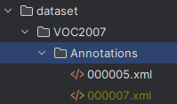
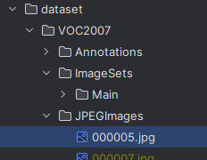
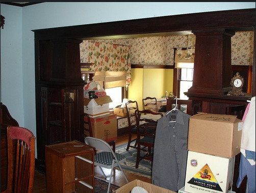
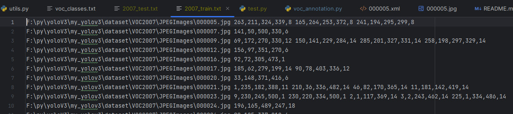
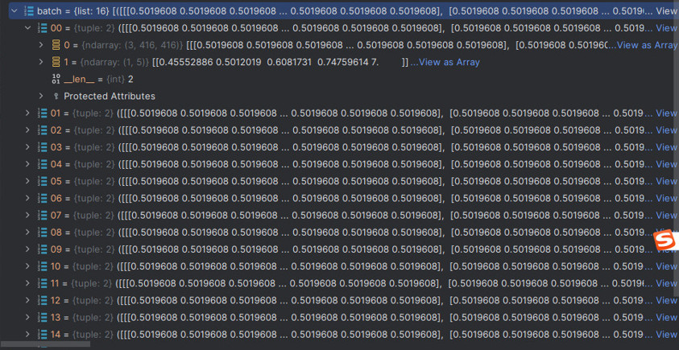
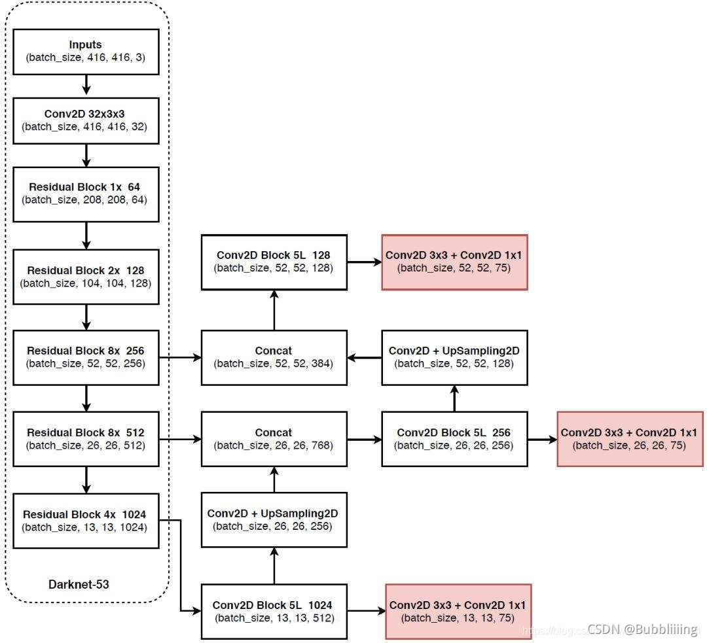
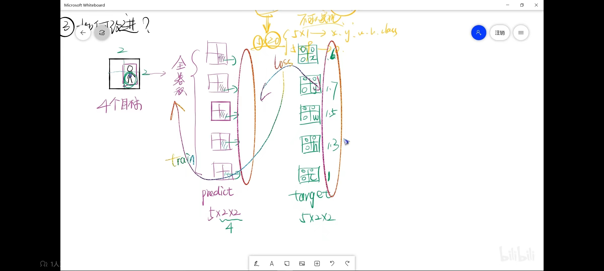
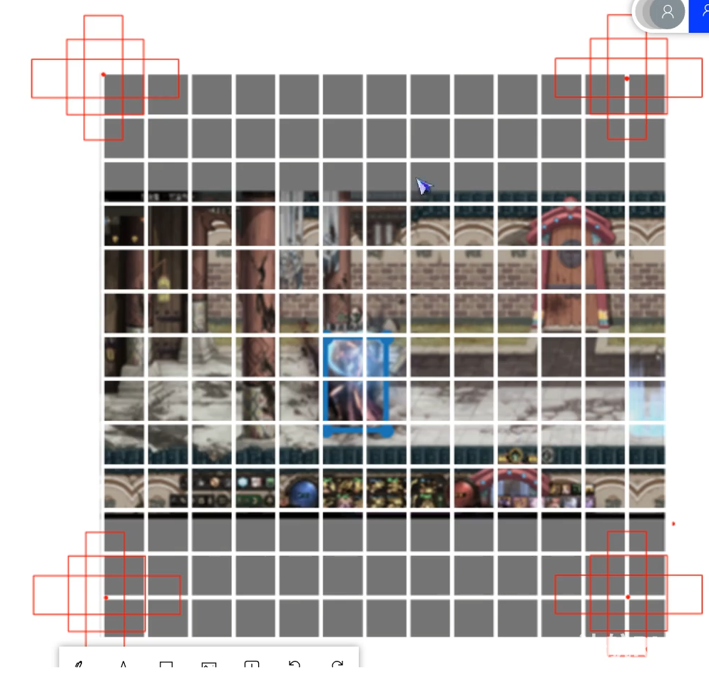

## YOLOV3介绍

### 数据集读取
本次使用VOC2007数据集，20分类


其中的內容如下
```xml
<annotation>
	<folder>VOC2007</folder>
	<filename>000005.jpg</filename>
	<source>
		<database>The VOC2007 Database</database>
		<annotation>PASCAL VOC2007</annotation>
		<image>flickr</image>
		<flickrid>325991873</flickrid>
	</source>
	<owner>
		<flickrid>archintent louisville</flickrid>
		<name>?</name>
	</owner>
	<size>
		<width>500</width>
		<height>375</height>
		<depth>3</depth>
	</size>
	<segmented>0</segmented>
	<object>
		<name>chair</name>
		<pose>Rear</pose>
		<truncated>0</truncated>
		<difficult>0</difficult>
		<bndbox>
			<xmin>263</xmin>
			<ymin>211</ymin>
			<xmax>324</xmax>
			<ymax>339</ymax>
		</bndbox>
	</object>
	<object>
		<name>chair</name>
		<pose>Unspecified</pose>
		<truncated>0</truncated>
		<difficult>0</difficult>
		<bndbox>
			<xmin>165</xmin>
			<ymin>264</ymin>
			<xmax>253</xmax>
			<ymax>372</ymax>
		</bndbox>
	</object>
	<object>
		<name>chair</name>
		<pose>Unspecified</pose>
		<truncated>1</truncated>
		<difficult>1</difficult>
		<bndbox>
			<xmin>5</xmin>
			<ymin>244</ymin>
			<xmax>67</xmax>
			<ymax>374</ymax>
		</bndbox>
	</object>
	<object>
		<name>chair</name>
		<pose>Unspecified</pose>
		<truncated>0</truncated>
		<difficult>0</difficult>
		<bndbox>
			<xmin>241</xmin>
			<ymin>194</ymin>
			<xmax>295</xmax>
			<ymax>299</ymax>
		</bndbox>
	</object>
	<object>
		<name>chair</name>
		<pose>Unspecified</pose>
		<truncated>1</truncated>
		<difficult>1</difficult>
		<bndbox>
			<xmin>277</xmin>
			<ymin>186</ymin>
			<xmax>312</xmax>
			<ymax>220</ymax>
		</bndbox>
	</object>
</annotation>
```
主要涉及到对 `name` 和 `bndbox` 的读取 代表物体类别和物体的坐标框
对之应的图片信息



另外 `imageSets` 中存在 `/Main/train.txt` 和 `Main/test.txt` 里面分别是索引训练和验证的图片集合，通过读取这里的每一行文件名，对应到`Annotation` 文件夹中的xml文件，对其进行解析，分别写入 `2007_train.txt`和 `2007_test.txt` 文件中，方便后期 dataset 的读取

解析代码如下：
```python
import os
import xml.etree.ElementTree as ET
from utils.utils import get_classes

classes, classes_len = get_classes('dataset/voc_classes.txt')


def convert_annotation(image_id, list_file):
    dataset_path = 'dataset/VOC2007/Annotations'
    lines_data = []
    annotation_path = os.path.join(dataset_path, image_id + ".xml")

    with open(annotation_path) as f:
        tree = ET.parse(f)
        root = tree.getroot()

        for obj in root.iter("object"):
            difficult = 0
            if obj.find('difficult') != None:
                difficult = obj.find('difficult').text
            cls = obj.find("name").text

            if cls not in classes or int(difficult) == 1: # difficult 标签为1 可以不要，为了减小计算量
                continue

            cls_id = str(classes.index(cls))
            lines_data.append(annotation_path)
            boxes = obj.find("bndbox")
            x_min = boxes.find("xmin").text
            y_min = boxes.find("ymin").text
            x_max = boxes.find("xmax").text
            y_max = boxes.find("ymax").text
            list_file.write(' ' + x_min + "," + y_min + "," + x_max + "," + y_max + "," + cls_id)

if __name__ == "__main__":
    image_ids = open('dataset/VOC2007/ImageSets/Main/train.txt').read().strip().split()
    list_file = open('2007_train.txt', 'w')
    for img_id in image_ids:
        list_file.write(os.path.abspath(os.path.join('dataset/VOC2007/JPEGImages', img_id + '.jpg')))
        convert_annotation(img_id, list_file)
        list_file.write('\n')
    list_file.close()

    image_ids = open('dataset/VOC2007/ImageSets/Main/test.txt').read().strip().split()
    list_file = open('2007_test.txt', 'w')
    for img_id in image_ids:
        list_file.write(os.path.abspath(os.path.join('dataset/VOC2007/JPEGImages', img_id + '.jpg')))
        convert_annotation(img_id, list_file)
        list_file.write('\n')
    list_file.close()

```

最终数据提取完后如下：


这样，就可以进行数据集的加载了
首先明确几个点
1、yoloV3 约定输入的图片尺寸是416*416，那么如果对图片进行尺寸的缩放就必须进行对应bdbox的同等缩放
2、对每一个图片和bndbox 的数据集获取，我们约定都是是归一化的数据
最终一个图片输出的数据格式如下：
img`(3,416,416)`  ,    target`(n,5)` 这里的n代表有几个目标，5对应(x,y,w,h,cls)
如果batch_size = 16
就有一个list 包括16个 ``(img (3,416,416)  target(n,5))`
最终一个batch就会返回这样的数据

图5


代码如下：
```python
import torch
from torch.utils.data.dataset import Dataset
from PIL import Image
import numpy as np
from torch.utils.tensorboard import SummaryWriter
from utils.utils import cvtColor, preprocess_input

class YoloDataset(Dataset):
    def __init__(self, train_path, isTrain):
        super(YoloDataset, self).__init__()
        self.train_path = train_path
        self.input_shape = (416, 416)
        self.isTrain = isTrain

        self.lines = open(train_path, 'r').readlines()

    def __len__(self):
        return len(self.lines)

    def __getitem__(self, index):
        img, boxes = self.get_item_data(index) # 获取图片和 ground truth
        image = np.transpose(preprocess_input(np.array(img, dtype=np.float32)), (2, 0, 1))
        boxes = np.array(boxes, dtype=np.float32)

        if len(boxes) != 0:
            # ground truth 宽高进行归一化
            boxes[:, [0, 2]] = boxes[:, [0, 2]] / self.input_shape[1]
            boxes[:, [1, 3]] = boxes[:, [1, 3]] / self.input_shape[0]

            boxes[:, 2:4] = boxes[:, 2:4] - boxes[:, 0:2]  # 计算中心点xy
            boxes[:, 0:2] = boxes[:, 0:2] + boxes[:, 2:4] / 2  # 计算 ground truth 的w,h

        return image, boxes

    def get_item_data(self, index):
        item = self.lines[index].split()
        image = Image.open(item[0])
        image = cvtColor(image)

        iw, ih = image.size
        w, h = self.input_shape  # 416 * 416

        scale = min(w / iw, h / ih)
        nw = int(iw * scale)
        nh = int(ih * scale)
        dx = (w - nw) // 2
        dy = (h - nh) // 2

        # print("缩放比".format(scale))
        # print("原始图的寬高={},{}".format(iw,ih))
        # print("缩放后寬高={},{}".format(nw,nh))

        # 将原始图像进行缩放符合416*416 的输入特征
        image = image.resize((nw, nh), Image.BICUBIC)
        new_image = Image.new('RGB', (w, h), (128, 128, 128))
        new_image.paste(image, (dx, dy))
        image_data = np.array(new_image, np.float32)

        # 计算缩放后的bnd box
        box = np.array([np.array(list(map(int, box.split(',')))) for box in item[1:]])

        # bndbox 进行缩放后其他区域的填充操作 对应的 ground truth 框也需要进行dx dy 的偏移
        if len(box) > 0:
            box[:, [0, 2]] = box[:, [0, 2]] * nw/iw + dx
            box[:, [1, 3]] = box[:, [1, 3]] * nh/ih + dy
            box[:, 0:2][box[:, 0:2] < 0] = 0
            box[:, 2][box[:, 2] > w] = w
            box[:, 3][box[:, 3] > h] = h
            box_w = box[:, 2] - box[:, 0]
            box_h = box[:, 3] - box[:, 1]
            box = box[np.logical_and(box_w > 1, box_h > 1)]  # discard invalid box
        return image_data, box

```

如上为了每一个img 和 target 对应起来送入网络进行训练，于是便有了这样的代码。
这个方法将在DataLoader 中作为参数让getItem 的数据进行这样的处理送入网络进行训练，
否则直接给网络送入`图5`的数据网络是无法进行数据读取训练的
```python
def yolo_dataset_collate(batch):
    # 方法1
    images = []
    bboxes = []
    for img, box in batch:
        images.append(img)
        bboxes.append(box)

    images = torch.from_numpy(np.array(images)).type(torch.FloatTensor)
    bboxes = [torch.from_numpy(ann).type(torch.FloatTensor) for ann in bboxes]
    return images, bboxes
```

最终送给网络的数据是 （batch_size,3,416,416）(batch_size,n,5)

### 主干特征提取网络

主干特征提取使用的是作者的draknet53网络，对输入进行 Cov2D、BatchNormal、LeakRelu激活
之后进行残差快的堆叠如图
Yolo Head对三个有效特征层（分别是52*52*256、26*26*512、13*13*1024）进行FPN构建
1、(batch_size,13,13,1024)的输出 进行5次卷积得到 (batch_size,13,13,512)的特征输出，进行上采样得到(batch_size,26,26,256)的同时进行两次卷积，得到(bs,13,13,75) 的Yolo层输出

2、将(bs,26,26,512)的输出和1中经过上采样的结果进行通维度的道叠加得到（bs,26,26,768）,将这个结果再进行5次卷积得到(bs,26,26,256)，将卷积进行上采样得到（bs,25,26,128）的结果. 另外将进行5次卷积得到的结果进行2次卷积得到 (bs,26,26,75) 的的Yolo层网络输出

3、将（bs,52,52,256）的特征和2中进行上采样的（bs,25,26,128）进行通道维度的叠加，得到（bs,52,52,384）的结果，对这个结果在进行5次卷积得到（bs,52,52,128）的结果 在进行 2次卷积，得到（bs,52,52,75）的Yolo层输出

其中每一层的75 代表的是  （x,y,w,h,conf+cls） ， 共有3个先验框的结果， 是VOC2007的20分类，所以是 （5+20）* 3=75 如果是COCO数据集80 分类那么这里的20就替换为80了.
具体实现代码：
darknet53部分
```python
import math

from torch import nn
from collections import OrderedDict


class BasicBlock(nn.Module):
    def __init__(self, in_channel, channels):
        super(BasicBlock, self).__init__()
        # print("input={},output={}".format(in_channel, channels[0]))
        self.conv1 = nn.Conv2d(in_channels=in_channel,
                               out_channels=channels[0],
                               kernel_size=1, stride=1, padding=0,
                               bias=False)
        self.bn1 = nn.BatchNorm2d(channels[0])
        self.relu1 = nn.LeakyReLU(0.1)

        self.conv2 = nn.Conv2d(in_channels=channels[0],
                               out_channels=channels[1],
                               kernel_size=3, stride=1, padding=1,
                               bias=False)
        self.bn2 = nn.BatchNorm2d(channels[1])
        self.relu2 = nn.LeakyReLU(0.1)

    def forward(self, x):
        residual = x
        out = self.conv1(x)
        out = self.bn1(out)
        out = self.relu1(out)

        out = self.conv2(out)
        out = self.bn2(out)
        out = self.relu2(out)

        return residual + out


class DarkNet(nn.Module):
    def __init__(self, layers):
        super(DarkNet, self).__init__()
        self.in_channel = 32
        # 416,416,3 -> 416,416,32
        self.conv1 = nn.Conv2d(3, self.in_channel, kernel_size=3, stride=1, padding=1, bias=False)
        self.bn1 = nn.BatchNorm2d(self.in_channel)
        self.relu1 = nn.LeakyReLU(0.1)

        # 416,416,32 -> 208,208,64
        self.layer1 = self._make_layer([32, 64], layers[0])
        # 208,208,64 -> 104,104,128
        self.layer2 = self._make_layer([64, 128], layers[1])
        # 104,104,128 -> 52,52,256
        self.layer3 = self._make_layer([128, 256], layers[2])
        # 52,52,256 -> 26,26,512
        self.layer4 = self._make_layer([256, 512], layers[3])
        # 26,26,512 -> 13,13,1024
        self.layer5 = self._make_layer([512, 1024], layers[4])

        self.layers_out_filters = [64, 128, 256, 512, 1024]

        # 进行权值初始化
        for m in self.modules():
            if isinstance(m, nn.Conv2d):
                n = m.kernel_size[0] * m.kernel_size[1] * m.out_channels
                m.weight.data.normal_(0, math.sqrt(2. / n))
            elif isinstance(m, nn.BatchNorm2d):
                m.weight.data.fill_(1)
                m.bias.data.fill_(0)

    def forward(self, x):
        x = self.conv1(x)
        x = self.bn1(x)
        x = self.relu1(x)

        x = self.layer1(x)
        x = self.layer2(x)
        out3 = self.layer3(x)
        out4 = self.layer4(out3)
        out5 = self.layer5(out4)

        return out3, out4, out5

    def _make_layer(self, channels, block_size):
        layers = []
        layers.append(("ds_conv",
                       nn.Conv2d(in_channels=self.in_channel, out_channels=channels[1], kernel_size=3, stride=2,
                                 padding=1, bias=False)))
        layers.append(("ds_bn", nn.BatchNorm2d(channels[1])))
        layers.append(("ds_relu", nn.LeakyReLU(0.1)))
        self.in_channel = channels[1]
        for i in range(0, block_size):
            layers.append(("residual_{}".format(i), BasicBlock(in_channel=self.in_channel, channels=channels)))

        return nn.Sequential(OrderedDict(layers))

def darknet53():
    model = DarkNet([1, 2, 8, 8, 4])
    return model
```

YoloV3网络部分：
```python
from collections import OrderedDict

import torch
import torch.nn as nn
from nets.darknet53 import darknet53


def conv2d(filter_in, filter_out, kernel_size):
    pad = (kernel_size - 1) // 2 if kernel_size else 0
    return nn.Sequential(OrderedDict([
        ("conv", nn.Conv2d(filter_in, filter_out, kernel_size=kernel_size, stride=1, padding=pad, bias=False)),
        ("bn", nn.BatchNorm2d(filter_out)),
        ("relu", nn.LeakyReLU(0.1))
    ]))

def make_last_layer(in_filters, filters_list, out_filter):
    m = nn.Sequential(
        conv2d(in_filters, filters_list[0], 1),
        conv2d(filters_list[0], filters_list[1], 3),
        conv2d(filters_list[1], filters_list[0], 1),
        conv2d(filters_list[0], filters_list[1], 3),
        conv2d(filters_list[1], filters_list[0], 1),
        conv2d(filters_list[0], filters_list[1], 3),
        nn.Conv2d(filters_list[1], out_filter, kernel_size=1, bias=True)
    )
    return m


class YoloNet(nn.Module):
    def __init__(self, anchors_mask, num_classes, pretrained=False):
        super(YoloNet, self).__init__()
        # ========================#
        # 生成darknet53 主干网络
        # 获取三个共享特征层,分别是
        # 13,13,1024
        # 26,26,512
        # 52,52,256
        # ========================#
        self.backbone = darknet53()

        if pretrained:
            self.backbone.load_state_dict(torch.load("model/darknet53_backbone_weights.pth"))

        out_filters = self.backbone.layers_out_filters

        # 初始化yolo的输出通道
        # 输出通道75 = 3*(5+20) = 3*((4+1) + 20分类(对于V0C2007数据集))

        # 将输出13,13,75
        self.last_layer0 = make_last_layer(1024, [512, 1024], len(anchors_mask[0]) * (num_classes + 5))  # VOC数据集20 分类

        # 输出13,13,512
        self.last_layer1_conv = conv2d(512, 256, 1)
        # 输出 26,26,256
        self.last_layer1_upsample = nn.Upsample(scale_factor=2, mode='nearest')
        # 输出 26,26,75
        self.last_layer1 = make_last_layer(512 + 256, [256, 512], len(anchors_mask[1]) * (num_classes + 5)) # VOC数据集20 分类

        # 输出26,26,256
        self.last_layer2_conv = conv2d(256, 128, 1)
        # 输出52,52,128
        self.last_layer2_upsample = nn.Upsample(scale_factor=2, mode='nearest')
        # 输出52,52,75
        self.last_layer2 = make_last_layer(256 + 128, [128, 256], len(anchors_mask[2]) * (num_classes + 5)) # VOC数据集20 分类

    def forward(self, x):
        x52, x26, x13 = self.backbone(x)
        # self.last_layer13[:5] 其实就是对make_last_layer 的模型取前5个,方便后面用x13_branch 进行1x1卷积和上采样
        x13_branch = self.last_layer0[:5](x13)  # [13,13,512]
        x13_branch_out = self.last_layer0[5:](x13_branch) # [13,13,75]

        # 对13*13的conv五次卷积结果进行1x1卷积和上采样
        x13_branch_conv1x1 = self.last_layer1_conv(x13_branch) # [13,13,256]
        x13_branch_upsample = self.last_layer1_upsample(x13_branch_conv1x1) # [26,26,256]

        # 26,26,512 + 26,26,256 -> 26,26,768
        out26concat = torch.concat([x13_branch_upsample, x26], dim=1)
        x26_branch = self.last_layer1[:5](out26concat)  # [26,26,256]
        x26_branch_out = self.last_layer1[5:](x26_branch) # [26,26,75}

        x26_branch_conv1x1 = self.last_layer2_conv(x26_branch) # [26,26,128]
        x26_branch_upsample = self.last_layer2_upsample(x26_branch_conv1x1) # [52,52,128]
        out52concat = torch.concat([x26_branch_upsample, x52], dim=1) # [52,52,384]

        # 52, 52, 384 -> 52, 52, 75
        x52_branch_out = self.last_layer2(out52concat) # [52,52,75]

        return x13_branch_out, x26_branch_out, x52_branch_out
```


### 损失函数
1、首先损失是计算预测与目标之间对应数据的差距值，那网络的输出是什么呢？
是
（batch_size,13,13,75）
（batch_size,26,26,75）
（batch_size,52,52,75）

那我们也得对目标进行同样的 输出编码，和预测数据对应即可.
例如

将一张图片进行全卷积然后输出5\*2\*2 的结构
与之对应的标签数据也转换成为5\*2\*2 的结构
这样将 预测 和 标签送入loss 函数进行loss 求解即可。
那么对于
（batch_size,13,13,75） 的 预测输出 是什么样子呢？
是
（batch_size,13,13,5,20）  这里 13 \* 13 是网络对于大目标的预测Yolo layer , 5 是 (x,y,w,h,conf) ,20 是 20 个分类，预测结果的类别个数
那么网络预测一个batch中数据是这样子的


那么也需要将对应的标签结果转换成这样，与预测结果进行loss 比对即可。

具体操作：

因为我们在dataset 数据处理环节已经将标签值进行了归一化，那么x,y,w,h 进行了归一化，让这个值 (x,w) \* input_w ； (y,h) \* input_h 就将这些数据表示在特征层上了。

将这些基于特征层上的 x,y,w,h 再和每一个gird 所对应的先验框 进行iou的比对，找出最每一个真实框重合度最高的iou的index. 找到这个真实框是属于哪一个先验框的范围内（比如算出来的先验框 重合度最高的是在 6 ，那么计算出来是在 anchors_mask=[[6, 7, 8], [3, 4, 5], [0, 1, 2] 中的 [6, 7, 8] 层中）那么将这个特征所在的 先验框 记录下来，并将真实框对应的 归一化后的数据进行标记，那么就构建了一个和预测数据同样shape结构的真实数据shape结构，那么就可以进行loss计算了

```python
import numpy as np
import torch.nn.init
from torch import nn
import math
from functools import partial


class YOLOLoss(nn.Module):
    def __init__(self, anchors, number_classes, input_shape, device, anchors_mask=[[6, 7, 8], [3, 4, 5], [0, 1, 2]]):
        super(YOLOLoss, self).__init__()
        self.anchors = anchors
        self.number_classes = number_classes
        self.bbox_attrs = 5 + number_classes
        self.input_shape = input_shape
        self.device = device
        self.anchors_mask = anchors_mask
        self.ignore_threshold = 0.5
        # self.loss_fn = nn.BCELoss()
        # self.loss_fn.to(device)

        self.box_ratio = 0.05
        self.obj_ratio = 5 * (input_shape[0] * input_shape[1]) / (416 ** 2)
        self.cls_ratio = 1 * (number_classes / 80)
        self.balance = [0.4, 1.0, 4]

    def forward(self, l, input, targets=None):
        # l：当前第几个特征层
        # input 输入进来的特征层 shape 为：
        # bs, 3*(5+num_classes), 13 ,13
        # bs, 3*(5+num_classes), 26 ,26
        # bs, 3*(5+num_classes), 52 ,52
        # targets 代表的是真实框
        bs = input.shape[0]
        in_h = input.shape[2]
        in_w = input.shape[3]

        # 计算步长
        # 每一个特征图上的点对应到原图上多少个像素点
        # 如果是13 * 13 的特征图的话，一个特征点就对应原来图上的32 个像素点
        # 如果是26 * 26 的特征图的话，一个特征点就对应原来图上的16 个像素点
        # 如果是52 * 52 的特征图的话，一个特征点就对应原来图上的8 个像素点
        # stride_h = stride_w = 32, 16, 8
        stride_h = self.input_shape[0] / in_h
        stride_w = self.input_shape[1] / in_w

        # 此时获得的scaled——anchor 大小是相对于特征图的
        scaled_anchors = [(a_w / stride_w, a_h / stride_h) for a_w, a_h in self.anchors]

        # 对于输入的特征图对他们进行review
        # bs, 3*(5 + number_classes), 52 ,52
        # print("input shape", input.shape)

        # 将输入转为最终的输出shape
        # bs, 3*(5 + number_classes), 52 ,52  --->  bs , 3 , 13, 13 ,5+20
        prediction = input.view(bs, len(self.anchors_mask[l]), self.bbox_attrs, in_h, in_w).permute(0, 1, 3, 4, 2).contiguous()

        # 先验框中心调整至参数
        x = torch.sigmoid(prediction[..., 0])  # 取最后一个维度的 第 0 轴的 数据
        y = torch.sigmoid(prediction[..., 1])  # 取最后一个维度的 第 1 轴的 数据

        # 先验框的宽高调整参数
        h = prediction[..., 2]  # 取最后一个维度的 第 2 轴的 数据
        w = prediction[..., 3]  # 取最后一个维度的 第 3 轴的 数据
        conf = torch.sigmoid(prediction[..., 4])  # 取最后一个维度的 第 4 轴的 数据 置信度

        # 获取分类结果的置信度
        pred_cls = torch.sigmoid(prediction[..., 5:])

        # 获取网络应有的预测结果
        y_true, noobj_mask, box_loss_scale = self.get_target(l, targets, scaled_anchors, in_h, in_w)

        # ---------------------------------------------------------------#
        #   将预测结果进行解码，判断预测结果和真实值的重合程度
        #   如果重合程度过大则忽略，因为这些特征点属于预测比较准确的特征点
        #   作为负样本不合适
        # ----------------------------------------------------------------#
        noobj_mask, pred_boxes = self.get_ignore(l, x, y, h, w, targets, scaled_anchors, in_h, in_w, noobj_mask)

        # if cuda:
        y_true = y_true.type_as(x)
        noobj_mask = noobj_mask.type_as(x)
        box_loss_scale = box_loss_scale.type_as(x)

        # --------------------------------------------------------------------------#
        #   box_loss_scale是真实框宽高的乘积，宽高均在0-1之间，因此乘积也在0-1之间。
        #   2-宽高的乘积代表真实框越大，比重越小，小框的比重更大。
        # --------------------------------------------------------------------------#
        box_loss_scale = 2 - box_loss_scale

        loss = 0
        # 真实框存在目标的地方 标记为True
        obj_mask = y_true[..., 4] == 1
        n = torch.sum(obj_mask)
        if n != 0:
            # if self.giou:
            # ---------------------------------------------------------------#
            #   计算预测结果和真实结果的giou
            # ----------------------------------------------------------------#
            giou = self.box_giou(pred_boxes, y_true[..., :4]).type_as(x)
            loss_loc = torch.mean((1 - giou)[obj_mask])  # 只计算有目标的位置和预测值之间的损失

            # loss_cls = self.loss_fn(pred_cls[obj_mask], y_true[..., 5:][obj_mask])
            loss_cls = torch.mean(self.BCELoss(pred_cls[obj_mask], y_true[..., 5:][obj_mask]))
            loss += loss_loc * self.box_ratio + loss_cls * self.cls_ratio

        # loss_conf = self.loss_fn(conf, obj_mask)
        loss_conf = torch.mean(self.BCELoss(conf, obj_mask.type_as(conf))[noobj_mask.bool() | obj_mask])
        loss += loss_conf * self.balance[l] * self.obj_ratio

        return loss

    def get_target(self, l, targets, scaled_anchors, in_h, in_w):
        # 真实数据的一个batch 共有多少张图
        bs = len(targets)

        # 用于选取哪些先验框不包含物体
        noobj_mask = torch.ones(bs, len(self.anchors_mask[l]), in_h, in_w, requires_grad=False)

        box_loss_scale = torch.zeros(bs, len(self.anchors_mask[l]), in_h, in_w, requires_grad=False)

        # batch_size, 3, 13, 13, 5 + num_classes
        y_true = torch.zeros(bs, len(self.anchors_mask[l]), in_h, in_w, self.bbox_attrs, requires_grad=False)

        for b in range(bs):
            if len(targets[b]) == 0:  # 没有真实框，忽略
                continue

            batch_target = torch.zeros_like(targets[b])

            # 将 tensor target * 输入特征图的高宽，获得真实框在特征图上的中心点坐标值和宽高值
            batch_target[:, [0, 2]] = targets[b][:, [0, 2]] * in_w
            batch_target[:, [1, 3]] = targets[b][:, [1, 3]] * in_h
            batch_target[:, 4] = targets[b][:, 4]
            batch_target = batch_target.cpu()

            # 将真实框和anchors 的框框左上角重合计算iou，看是属于哪一个范围内的框框（例如计算出来的可能是13*13里的大物体或者26*26中等物体52*52 小物体）
            # torch.zeros(batch_target.size(0), 2)  一个图中有多少个真实框
            # batch_target[:, 2:4] 拿到真实框的右下角坐标
            #  num_true_box, 4  将中心点固定在0,0 组成 （0,0,高,宽）样子的坐标
            gt_box = torch.FloatTensor(torch.cat((torch.zeros((batch_target.size(0), 2)), batch_target[:, 2:4]), dim=1))

            # 将中心点固定在0,0 组成 （0，0，高，宽）样子的坐标
            anchor_boxes = torch.FloatTensor(torch.cat((torch.zeros((len(scaled_anchors), 2)), torch.FloatTensor(scaled_anchors)),  dim=1))
            # 这样以来就能固定中心点，计算真实框 和 每一个anchors 的 iou 从而得到当前真实框是属于哪一个类型的anchors,比如大目标的框、中等目标的框、小目标的框
            # 这里就是在计算 当前真实框是属于哪个目标范围框框内的的最大的iou
            # 比如图片内那只狗，它计算出来可能就用最大的竖向的框去框它，
            # 再或者street.jpg 中有一个自行车，那么就用中等框横向的框这个自行车
            # shape = [num_true_box , 9] 代表每一个真实框和先验框的重合情况
            best_ns = torch.argmax(self.calculate_iou(gt_box, anchor_boxes), dim=-1)

            for t, best_n in enumerate(best_ns):
                if best_n not in self.anchors_mask[l]:
                    continue

                # 判断当前先验框是当前特征的那一个先验框
                k = self.anchors_mask[l].index(best_n)

                # 获得真实框属于哪个网格点
                i = torch.floor(batch_target[t, 0]).long()
                j = torch.floor(batch_target[t, 1]).long()

                # 取出真实框的种类
                c = batch_target[t, 4].long()

                noobj_mask[b, k, j, i] = 0

                # ----------------------------------------#
                #   tx、ty代表中心调整参数的真实值
                # ----------------------------------------#
                y_true[b, k, j, i, 0] = batch_target[t, 0]
                y_true[b, k, j, i, 1] = batch_target[t, 1]
                y_true[b, k, j, i, 2] = batch_target[t, 2]
                y_true[b, k, j, i, 3] = batch_target[t, 3]
                y_true[b, k, j, i, 4] = 1
                y_true[b, k, j, i, c + 5] = 1

                # ----------------------------------------#
                #  TODO 这里是什么含义呢
                #   用于获得xywh的比例
                #   大目标loss权重小，小目标loss权重大     这里 用目标值的 w,h 相互× ，然后再除去 这个网络的网格宽高，就得到一个当前网格宽高相对于特征层分辨率（13*13 ，26*26 ，52 *52）的比值，
                #   又因为 大目标选择的是 13* 13 的 小目标选择是 52*52 的，所以这样算下来会得到一个目标相对于当前层的宽高 的比值，所以大目标的比值大， 小目标的比值小， 用 1 - 这个值就得到
                #   小目标的损失大，大目标的损失小
                # ----------------------------------------#
                box_loss_scale[b, k, j, i] = batch_target[t, 2] * batch_target[t, 3] / in_w / in_h
        return y_true, noobj_mask, box_loss_scale

    def get_ignore(self, l, x, y, h, w, targets, scaled_anchors, in_h, in_w, noobj_mask):
        # print("in_h={},in_w={}".format(in_h, in_w))
        # print(l)
        # print(self.anchors_mask[l])
        bs = len(targets)

        # start(float) - 区间的起始点
        # end (float) - 区间的终点
        # steps(int）- 在start 和 end间生成的样本数
        # 这里就是在构造网格,x 方向从 0....12  y 方向从 0...12
        grid_x = (torch.linspace(0, in_w - 1, in_w).repeat(in_h, 1)
                  .repeat(int(bs * len(self.anchors_mask[l])), 1, 1)
                  .view(x.shape)
                  .type_as(x))
        grid_y = (torch.linspace(0, in_h - 1, in_h)
                  .repeat(in_w, 1)
                  .t()
                  .repeat(int(bs * len(self.anchors_mask[l])), 1, 1)
                  .view(y.shape)
                  .type_as(x))

        # 生成对应层l 的 先验框的宽高
        scaled_anchors_l = np.array(scaled_anchors)[self.anchors_mask[l]]
        anchor_w = torch.Tensor(scaled_anchors_l).index_select(dim=1, index=torch.LongTensor([0])).type_as(x)
        anchor_h = torch.Tensor(scaled_anchors_l).index_select(dim=1, index=torch.LongTensor([1])).type_as(x)
        # print("anchor_w", anchor_w)

        # 给网格上的每一个点构造 这个点对应的 先验框的 在特征图上的w,h
        # 针对13*13 的网格 的 先验框 w, h:
        # ((3.625, 2.8125), (4.875, 6.1875), (11.65625, 10.1875))
        # 13*13 = 169 个 (3.625,4.875,11.65625)
        # 有 batch_size 个图 ，所以 最后是 batch_size * 169 个 网格点，每个点都有与之对应的先验框w,h
        # 下面这段代码就是实现了以上的描述,构造了每一个网格点的w,h
        anchor_w = anchor_w.repeat(bs, 1).repeat(1, 1, in_h * in_w).view(w.shape)
        anchor_h = anchor_h.repeat(bs, 1).repeat(1, 1, in_h * in_w).view(h.shape)

        pre_box_x = torch.unsqueeze(x + grid_x, -1)
        pre_box_y = torch.unsqueeze(y + grid_y, -1)
        pre_box_w = torch.unsqueeze(torch.exp(w) * anchor_w, -1)
        pre_box_h = torch.unsqueeze(torch.exp(h) * anchor_h, -1)

        pre_boxes = torch.cat([pre_box_x, pre_box_y, pre_box_w, pre_box_h], -1)

        for b in range(bs):
            # 将预测框按照batch_size 维度一个一个取出来，然后进行view,
            pre_box_for_ignore = pre_boxes[b].view(-1, 4)

            # 将真实框转换为相对于特征层的大小
            if len(targets[b]) > 0:
                batch_target = torch.zeros_like(targets[b])
                batch_target[:, [0, 2]] = targets[b][:, [0, 2]] * in_w
                batch_target[:, [1, 3]] = targets[b][:, [1, 3]] * in_h
                batch_target = batch_target[:, :4].type_as(x)

                # 计算真实框 和 每一个预测框的 iou
                # (3, 3*13*13)
                anch_ious = self.calculate_iou(batch_target, pre_box_for_ignore)

                # 每个先验框对应真实框的最大重合度
                anchor_iou_max, _ = torch.max(anch_ious, dim=0)
                anchor_iou_max = anchor_iou_max.view(pre_boxes[b].size()[:3])

                # 当前batch_size 的 对应位置的iou 是不是大于 阈值,
                # 如果大于阈值则认为是有目标的，设置为0
                noobj_mask[b][anchor_iou_max > self.ignore_threshold] = 0

        return noobj_mask, pre_boxes

    def calculate_iou(self, _box_a, _box_b):
        # -----------------------------------------------------------#
        #   计算真实框的左上角和右下角
        # -----------------------------------------------------------#
        b1_x1, b1_x2 = _box_a[:, 0] - _box_a[:, 2] / 2, _box_a[:, 0] + _box_a[:, 2] / 2
        b1_y1, b1_y2 = _box_a[:, 1] - _box_a[:, 3] / 2, _box_a[:, 1] + _box_a[:, 3] / 2
        # -----------------------------------------------------------#
        #   计算先验框获得的预测框的左上角和右下角
        # -----------------------------------------------------------#
        b2_x1, b2_x2 = _box_b[:, 0] - _box_b[:, 2] / 2, _box_b[:, 0] + _box_b[:, 2] / 2
        b2_y1, b2_y2 = _box_b[:, 1] - _box_b[:, 3] / 2, _box_b[:, 1] + _box_b[:, 3] / 2

        # -----------------------------------------------------------#
        #   将真实框和预测框都转化成左上角右下角的形式
        # -----------------------------------------------------------#
        box_a = torch.zeros_like(_box_a)
        box_b = torch.zeros_like(_box_b)
        box_a[:, 0], box_a[:, 1], box_a[:, 2], box_a[:, 3] = b1_x1, b1_y1, b1_x2, b1_y2
        box_b[:, 0], box_b[:, 1], box_b[:, 2], box_b[:, 3] = b2_x1, b2_y1, b2_x2, b2_y2

        # -----------------------------------------------------------#
        #   A为真实框的数量，B为先验框的数量
        # -----------------------------------------------------------#
        A = box_a.size(0)
        B = box_b.size(0)

        # -----------------------------------------------------------#
        #   计算交的面积
        # -----------------------------------------------------------#
        max_xy = torch.min(box_a[:, 2:].unsqueeze(1).expand(A, B, 2), box_b[:, 2:].unsqueeze(0).expand(A, B, 2))
        min_xy = torch.max(box_a[:, :2].unsqueeze(1).expand(A, B, 2), box_b[:, :2].unsqueeze(0).expand(A, B, 2))
        inter = torch.clamp((max_xy - min_xy), min=0)
        inter = inter[:, :, 0] * inter[:, :, 1]
        # -----------------------------------------------------------#
        #   计算预测框和真实框各自的面积
        # -----------------------------------------------------------#
        area_a = ((box_a[:, 2] - box_a[:, 0]) * (box_a[:, 3] - box_a[:, 1])).unsqueeze(1).expand_as(inter)  # [A,B]
        area_b = ((box_b[:, 2] - box_b[:, 0]) * (box_b[:, 3] - box_b[:, 1])).unsqueeze(0).expand_as(inter)  # [A,B]
        # -----------------------------------------------------------#
        #   求IOU
        # -----------------------------------------------------------#
        union = area_a + area_b - inter
        return inter / union  # [A,B]

    def box_giou(self, b1, b2):
        """
        输入为：
        ----------
        b1: tensor, shape=(batch, feat_w, feat_h, anchor_num, 4), xywh
        b2: tensor, shape=(batch, feat_w, feat_h, anchor_num, 4), xywh

        返回为：
        -------
        giou: tensor, shape=(batch, feat_w, feat_h, anchor_num, 1)
        """
        # ----------------------------------------------------#
        #   求出预测框左上角右下角
        # ----------------------------------------------------#
        b1_xy = b1[..., :2]
        b1_wh = b1[..., 2:4]
        b1_wh_half = b1_wh / 2.
        b1_mins = b1_xy - b1_wh_half
        b1_maxes = b1_xy + b1_wh_half
        # ----------------------------------------------------#
        #   求出真实框左上角右下角
        # ----------------------------------------------------#
        b2_xy = b2[..., :2]
        b2_wh = b2[..., 2:4]
        b2_wh_half = b2_wh / 2.
        b2_mins = b2_xy - b2_wh_half
        b2_maxes = b2_xy + b2_wh_half

        # ----------------------------------------------------#
        #   求真实框和预测框所有的iou
        # ----------------------------------------------------#
        intersect_mins = torch.max(b1_mins, b2_mins)
        intersect_maxes = torch.min(b1_maxes, b2_maxes)
        intersect_wh = torch.max(intersect_maxes - intersect_mins, torch.zeros_like(intersect_maxes))
        intersect_area = intersect_wh[..., 0] * intersect_wh[..., 1]
        b1_area = b1_wh[..., 0] * b1_wh[..., 1]
        b2_area = b2_wh[..., 0] * b2_wh[..., 1]
        union_area = b1_area + b2_area - intersect_area
        iou = intersect_area / union_area

        # ----------------------------------------------------#
        #   找到包裹两个框的最小框的左上角和右下角
        # ----------------------------------------------------#
        enclose_mins = torch.min(b1_mins, b2_mins)
        enclose_maxes = torch.max(b1_maxes, b2_maxes)
        enclose_wh = torch.max(enclose_maxes - enclose_mins, torch.zeros_like(intersect_maxes))
        # ----------------------------------------------------#
        #   计算对角线距离
        # ----------------------------------------------------#
        enclose_area = enclose_wh[..., 0] * enclose_wh[..., 1]
        giou = iou - (enclose_area - union_area) / enclose_area

        return giou

    def clip_by_tensor(self, t, t_min, t_max):
        t = t.float()
        result = (t >= t_min).float() * t + (t < t_min).float() * t_min
        result = (result <= t_max).float() * result + (result > t_max).float() * t_max
        return result

    def BCELoss(self, pred, target):
        epsilon = 1e-7
        pred = self.clip_by_tensor(pred, epsilon, 1.0 - epsilon)
        output = - target * torch.log(pred) - (1.0 - target) * torch.log(1.0 - pred)
        return output


def weights_init(net, init_type='normal', init_gain = 0.02):
    def init_func(m):
        classname = m.__class__.__name__
        if hasattr(m, 'weight') and classname.find('Conv') != -1:
            if init_type == 'normal':
                torch.nn.init.normal_(m.weight.data, 0.0, init_gain)
            elif init_type == 'xavier':
                torch.nn.init.xavier_normal_(m.weight.data, gain=init_gain)
            elif init_type == 'kaiming':
                torch.nn.init.kaiming_normal_(m.weight.data, a=0, mode='fan_in')
            elif init_type == 'orthogonal':
                torch.nn.init.orthogonal_(m.weight.data, gain=init_gain)
            else:
                raise NotImplementedError('initialization method [%s] is not implemented' % init_type)
        elif classname.find('BatchNorm2d') != -1:
            torch.nn.init.normal_(m.weight.data, 1.0, 0.02)
            torch.nn.init.constant_(m.bias.data, 0.0)
    print('initialize network with %s type' % init_type)
    net.apply(init_func)


def get_lr_scheduler(lr_decay_type, lr, min_lr, total_iters, warmup_iters_ratio=0.05, warmup_lr_ratio=0.1,
                     no_aug_iter_ratio=0.05, step_num=10):
    def yolox_warm_cos_lr(lr, min_lr, total_iters, warmup_total_iters, warmup_lr_start, no_aug_iter, iters):
        if iters <= warmup_total_iters:
            # lr = (lr - warmup_lr_start) * iters / float(warmup_total_iters) + warmup_lr_start
            lr = (lr - warmup_lr_start) * pow(iters / float(warmup_total_iters), 2) + warmup_lr_start
        elif iters >= total_iters - no_aug_iter:
            lr = min_lr
        else:
            lr = min_lr + 0.5 * (lr - min_lr) * (
                    1.0 + math.cos(
                math.pi * (iters - warmup_total_iters) / (total_iters - warmup_total_iters - no_aug_iter))
            )
        return lr

    def step_lr(lr, decay_rate, step_size, iters):
        if step_size < 1:
            raise ValueError("step_size must above 1.")
        n = iters // step_size
        out_lr = lr * decay_rate ** n
        return out_lr

    if lr_decay_type == "cos":
        warmup_total_iters = min(max(warmup_iters_ratio * total_iters, 1), 3)
        warmup_lr_start = max(warmup_lr_ratio * lr, 1e-6)
        no_aug_iter = min(max(no_aug_iter_ratio * total_iters, 1), 15)
        func = partial(yolox_warm_cos_lr, lr, min_lr, total_iters, warmup_total_iters, warmup_lr_start, no_aug_iter)
    else:
        decay_rate = (min_lr / lr) ** (1 / (step_num - 1))
        step_size = total_iters / step_num
        func = partial(step_lr, lr, decay_rate, step_size)

    return func


def set_optimizer_lr(optimizer, lr_scheduler_func, epoch):
    lr = lr_scheduler_func(epoch)
    for param_group in optimizer.param_groups:
        param_group['lr'] = lr

    print("epoch {} , set_optimizer_lr {} ".format(epoch, lr))

```
loss的计算论文中是分别进行计算
1、x y 中心点loss
2、w,h loss
3、cls 分类 loss
进行相加求损失和

但是有一个更好的计算iou损失的方法，就的**GIou**。比 正常计算1、2 回归损失更靠谱，本代码中采用的是GIou计算回归损失

计算 iou 13*13 的三种锚框

使用蓝色的真实框和每一个网格的左上角的点的3种比例的 锚框 进行交并比计算，能够算出来最接近的蓝色框的iou,那么就把这网格点标记为存在目标，将真实框的目标参数 设置给这个锚框，那么 y_true 就构造完成了，对应的 noobj_mask 表示 这个网格中心点是否存在目标，有目标标记为0，无目标默认为1。这个就是get_target 所完成的任务

get_ignore 是网络的预测值进行解码，将每一个预测的网格点 填充解码后的预测的数据，通过`torch.cat([pre_box_x, pre_box_y, pre_box_w, pre_box_h], -1)`构造成为和（x,y,w,h）结构的数据与真实框计算iou，取出每个先验框对应真实框的最大重合度iou ，最终就是 3\*13\*13 shape的 anchor_iou_max, 最终计算的是 13*13 的网格上每一个网格点和 真实框的 iou 值  shape（3,13,13）
最后对网格上的每一个点的iou 和 阈值 iou进行比较，大于阈值的iou(认为与真实框重合度较高) 并将 noobj_mask 对应位置设置为0，认为存在目标。

最终将这个真实框和预测框进行求损失


### 训练
1、迁移学习、加载模型权重
_ _ _
-	1.1	首先进行权重的参数初始化
		
    ```python
        def weights_init(net, init_type='normal', init_gain = 0.02):
        def init_func(m):
            classname = m.__class__.__name__
            if hasattr(m, 'weight') and classname.find('Conv') != -1:
                if init_type == 'normal':
                    # 从给定均值和标准差的正态分布N(0.0, init_gain)中生成值，填充输入的m.weight.data
                    torch.nn.init.normal_(m.weight.data, 0.0, init_gain)
                elif init_type == 'xavier':
                    torch.nn.init.xavier_normal_(m.weight.data, gain=init_gain)
                elif init_type == 'kaiming':
                    torch.nn.init.kaiming_normal_(m.weight.data, a=0, mode='fan_in')
                elif init_type == 'orthogonal':
                    torch.nn.init.orthogonal_(m.weight.data, gain=init_gain)
                else:
                    raise NotImplementedError('initialization method [%s] is not implemented' % init_type)
            elif classname.find('BatchNorm2d') != -1:
                torch.nn.init.normal_(m.weight.data, 1.0, 0.02)
                torch.nn.init.constant_(m.bias.data, 0.0)
        print('initialize network with %s type' % init_type)
        net.apply(init_func)
    ```
分别对 weight 参数初始化、BatchNorm2d 参数进行初始化

-   1.2	加载已经训练好的模型参数（迁移学习）
    ```python
    # ------------------------------------------------------#
    #   保存当前模型的权重
    # ------------------------------------------------------#
    model_dict = model.state_dict()

    # 将训练好的yolo网络权重加载进来， 和自己的yolo网络进行比对，加载已有的权重参数到自己的网络中来
    # 这就是迁移学习！！！
    if yolo_weight_pth != '':
        # 从外部文件加载的预训练模型的权重
        pretrained_dict = torch.load(yolo_weight_pth, map_location=device)

        load_key, no_load_key, temp_dict = [], [], {}

        # 循环遍历预训练权重字典：代码通过一个循环遍历 `pretrained_dict` 中的键-值对，其中键 `k` 是预训练权重的名称，值 `v` 是相应的权重张量。
        for k, v in pretrained_dict.items():
            # 比较权重形状：对于每个键 `k`，代码检查它是否存在于当前模型的权重字典 `model_dict` 中，
            # 并且检查权重的形状是否与当前模型中的权重形状相匹配。如果键 `k` 存在于 `model_dict` 中且形状匹配，
            # 那么将这个权重添加到临时字典 `temp_dict` 中，并将键 `k` 添加到 `load_key` 列表中，表示这个权重需要加载。
            if k in model_dict.keys() and np.shape(model_dict[k]) == np.shape(v):
                # 更新当前模型的权重字典：将临时字典 `temp_dict` 中的权重添加到当前模型的权重字典 `model_dict` 中，
                # 以确保只有匹配的权重被加载，不匹配的权重不会破坏当前模型的结构
                temp_dict[k] = v
                load_key.append(k)
                print("load {}  shape {}".format(k, np.shape(model_dict[k])))
            else:
                no_load_key.append(k)
                print("no load {} ".format(k))
        # 加载更新后的权重：最后，使用 `model.load_state_dict(model_dict)` 将更新后的权重加载到当前模型中，
        # 从而将预训练的权重应用到当前模型中
        model_dict.update(temp_dict)
        model.load_state_dict(model_dict)
    ```
    这样子模型就具备了特征提取的特性，方便后期进行图像的分类和 锚框参数的回归

2、动态调整学习率
_ _ _
参考：[https://blog.csdn.net/m0_51579041/article/details/137998084](https://blog.csdn.net/m0_51579041/article/details/137998084)
    
    ```python
    # ------------------------------#
    #   学习率调整策略：预热+余弦退火
    # ------------------------------#
    def get_lr_scheduler(lr_decay_type, lr, min_lr, total_iters, warmup_iters_ratio=0.05, warmup_lr_ratio=0.1,
                         no_aug_iter_ratio=0.05, step_num=10):
        def yolox_warm_cos_lr(lr, min_lr, total_iters, warmup_total_iters, warmup_lr_start, no_aug_iter, iters):
            # 前3轮进行warmup预测
            if iters <= warmup_total_iters:
                lr = (lr - warmup_lr_start) * pow(iters / float(warmup_total_iters), 2) + warmup_lr_start
            # 训练收官阶段，模型参数需要稳定，所以最后的15轮以最小的学习率进行训练
            elif iters >= total_iters - no_aug_iter:
                lr = min_lr
    
            # ------------------------------#
            # 中间轮数使用cos余弦退火策略
            # cos余弦退火：cos(当前训练轮数/总训练轮数)
            # ------------------------------#
            else:
                lr = min_lr + 0.5 * (lr - min_lr) * (
                        1.0 + math.cos(
                    math.pi * (iters - warmup_total_iters) / (total_iters - warmup_total_iters - no_aug_iter))
                )
            return lr
    
        def step_lr(lr, decay_rate, step_size, iters):
            if step_size < 1:
                raise ValueError("step_size must above 1.")
            n = iters // step_size
            out_lr = lr * decay_rate ** n
            return out_lr
    
        if lr_decay_type == "cos":
            # ------------------------------#
            #   预热轮数不超过3轮  1~3
            # ------------------------------#
            warmup_total_iters = min(max(warmup_iters_ratio * total_iters, 1), 3)
            warmup_lr_start = max(warmup_lr_ratio * lr, 1e-6)
    
            # ------------------------------#
            #   最小学习率轮数不少于15轮
            # ------------------------------#
            no_aug_iter = min(max(no_aug_iter_ratio * total_iters, 1), 15)
            func = partial(yolox_warm_cos_lr, lr, min_lr, total_iters, warmup_total_iters, warmup_lr_start, no_aug_iter)
        else:
            decay_rate = (min_lr / lr) ** (1 / (step_num - 1))
            step_size = total_iters / step_num
            func = partial(step_lr, lr, decay_rate, step_size)
    
        return func
    ```

3、Adam、SGD 优化器
_ _ _
```python
#---------------------------------------#
#   根据optimizer_type选择优化器
#---------------------------------------#
pg0, pg1, pg2 = [], [], []
for k, v in model.named_modules():
    if hasattr(v, "bias") and isinstance(v.bias, nn.Parameter):
        pg2.append(v.bias)
    if isinstance(v, nn.BatchNorm2d) or "bn" in k:
        pg0.append(v.weight)
    elif hasattr(v, "weight") and isinstance(v.weight, nn.Parameter):
        pg1.append(v.weight)
optimizer = {
    'adam'  : optim.Adam(params=pg0, lr=Init_lr_fit, betas = (momentum, 0.999)),
    'sgd'   : optim.SGD(params=pg0, lr=Init_lr_fit, momentum = momentum, nesterov=True)
}[optimizer_type]
optimizer.add_param_group({"params": pg1, "weight_decay": weight_decay})
optimizer.add_param_group({"params": pg2}) # 設置了3組optimizer ,每一组对应优化的参数对象不相同
```
对模型参数进行分组优化的示例。model.named_modules()会返回模型中所有模块的名字和它们的实例。这里通过条件判断将权重（weight）、偏置（bias）和批量归一化层的权重（weight）分别添加到不同的优化器组别中：

pg0用于存储所有nn.BatchNorm2d层的权重（weight），如果名字中包含"bn"也会被添加。
pg1用于存储具有nn.Parameter类型的权重，但不包括批量归一化层的权重。
pg2用于存储具有nn.Parameter类型的偏置。
然后，根据optimizer_type（如Adam或SGD）选择对应的优化器，并为每个分组设置不同的学习率和参数。pg1组应用了weight_decay，这是L2正则化的一部分。最后，optimizer.add_param_group将这些分组添加到总优化器中


SGD 和 Adam 介绍
[https://blog.csdn.net/S20144144/article/details/103417502?spm=1001.2101.3001.6650.2&utm_medium=distribute.pc_relevant.none-task-blog-2%7Edefault%7ECTRLIST%7ERate-2-103417502-blog-95355041.pc_relevant_recovery_v2&depth_1-utm_source=distribute.pc_relevant.none-task-blog-2%7Edefault%7ECTRLIST%7ERate-2-103417502-blog-95355041.pc_relevant_recovery_v2&utm_relevant_index=5](https://blog.csdn.net/S20144144/article/details/103417502?spm=1001.2101.3001.6650.2&utm_medium=distribute.pc_relevant.none-task-blog-2%7Edefault%7ECTRLIST%7ERate-2-103417502-blog-95355041.pc_relevant_recovery_v2&depth_1-utm_source=distribute.pc_relevant.none-task-blog-2%7Edefault%7ECTRLIST%7ERate-2-103417502-blog-95355041.pc_relevant_recovery_v2&utm_relevant_index=5)


### 预测
1、训练时候0-50 epoch 的时候 冻结主干特征提取网络的权重，让网络在yolo层进行学习。
```python
#------------------------------------#
#   冻结一定部分训练
#------------------------------------#
if Freeze_Train:
    for param in model.backbone.parameters():
        param.requires_grad = False
```
当网络在>50 epoch后 yolo层学习到内容，再对主干特征提取网络进行解冻，让yolo层和主干特征提取网络层之间进行微调

```python
if epoch >= Freeze_Epoch and not UnFreeze_flag and Freeze_Train:
    ****
    for param in model.backbone.parameters():
        param.requires_grad = True
```

正常的训练套路

```python
#----------------------#
#   前向传播
#----------------------#
outputs         = model_train(images)


loss_value_all  = 0
#----------------------#
#   计算损失
#----------------------#
for l in range(len(outputs)):
    loss_item = yolo_loss(l, outputs[l], targets)
    loss_value_all  += loss_item
loss_value = loss_value_all

#----------------------#
#   反向传播
#----------------------#
loss_value.backward()
optimizer.step()


拿到此刻的model
进行验证集验证，查看网络效果
for iteration, batch in enumerate(gen_val):
    if iteration >= epoch_step_val:
        break
    images, targets = batch[0], batch[1]
    with torch.no_grad():
        if cuda:
            images  = images.cuda(local_rank)
            targets = [ann.cuda(local_rank) for ann in targets]
        #----------------------#
        #   清零梯度
        #----------------------#
        optimizer.zero_grad()
        #----------------------#
        #   前向传播
        #----------------------#
        outputs         = model_train(images)

        loss_value_all  = 0
        #----------------------#
        #   计算损失
        #----------------------#
        for l in range(len(outputs)):
            loss_item = yolo_loss(l, outputs[l], targets)
            loss_value_all  += loss_item
        loss_value  = loss_value_all

    val_loss += loss_value.item()

```

最后保存这次的网络权重
```python
# -----------------------------------------------#
#   保存权值
# -----------------------------------------------#
if (epoch + 1) % save_period == 0 or epoch + 1 == Epoch:
    torch.save(model.state_dict(), os.path.join(save_dir, "ep%03d-loss%.3f-val_loss%.3f.pth" % (
    epoch + 1, loss / epoch_step, val_loss / epoch_step_val)))
```


### 备注
1、数据没有进行增强处理
2、本次网络学习使用的是Adam 优化器，但是作者使用的是SGD 优化器。（优化器的区别在前面训练第3小结引用的链接讲的非常好）

基于以上2点，本人训练出来的模型效果没有作者的效果好后期还会继续进行以上2点的尝试


